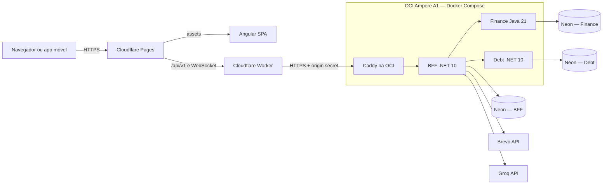

# ADR 0001 — Plataforma de staging com custo zero

- **Status:** Aceito
- **Data da decisão:** 17 de agosto de 2026
- **Escopo:** v0.2.0
- **Restrição principal:** custo financeiro mensal máximo igual a zero

## Contexto

O MVP v0.1.0 é reproduzível localmente com Docker Compose, mas ainda não possui
um ambiente público. O staging é destinado a demonstração e portfólio, não a
uma carga de produção com SLA.

A solução precisa manter as regras permanentes do produto:

- o Angular acessa somente o BFF;
- o BFF continua sendo o único ponto de autenticação de usuário, agregação e IA;
- BFF, Finance e Debt mantêm PostgreSQL independentes;
- Finance e Debt não publicam portas na internet;
- os backends continuam distribuídos em containers;
- secrets reais não entram no Git;
- indisponibilidade é preferível a qualquer cobrança automática.

## Decisão

### Componentes

| Componente | Provedor | Configuração inicial |
|---|---|---|
| Frontend Angular | Cloudflare Pages Free | assets estáticos, HTTPS e deploy pelo GitHub |
| Proxy same-origin | Cloudflare Worker Free | `/api/v1/*` e SignalR encaminhados ao BFF |
| Backends | OCI Ampere A1 Always Free | uma VM ARM64 com 2 OCPUs e 12 GB de RAM |
| BFF, Finance e Debt | Docker Compose na VM | somente o Caddy publica 80 e 443 |
| Entrada do BFF | Caddy | TLS automático e validação de secret do Worker |
| Bancos | Neon PostgreSQL Free | três projetos e três credenciais independentes |
| E-mail transacional | Brevo Free | API HTTPS, até 300 envios por dia |
| IA | Groq Free | acessado somente pelo BFF |
| Imagens Docker | GitHub Container Registry público | imagens multiarch fixadas por tag de versão |
| Infraestrutura como código | Terraform | rede e VM OCI reproduzíveis |

Fontes verificadas na data da decisão:

- [Cloudflare Pages — limites](https://developers.cloudflare.com/pages/platform/limits/)
- [Cloudflare Workers — limites](https://developers.cloudflare.com/workers/platform/limits/)
- [OCI Always Free](https://docs.oracle.com/en-us/iaas/Content/FreeTier/freetier_topic-Always_Free_Resources.htm)
- [Neon — preços e limites](https://neon.com/pricing)
- [Brevo — plano gratuito](https://help.brevo.com/hc/en-us/articles/208580669-FAQs-What-are-the-limits-of-the-Free-plan)
- [DuckDNS — FAQ do serviço gratuito](https://www.duckdns.org/faqs.jsp)

### Topologia

O navegador usa caminhos relativos `/api/v1`. O Worker executa o proxy sem
expor ao Angular a URL de origem. Dessa forma, o refresh token permanece em
cookie `HttpOnly`, `Secure` e `SameSite=Strict`, e o SignalR usa a mesma origem
do frontend.

Finance e Debt participam somente da rede Docker de serviços. Eles não possuem
`ports` no Compose de staging. A comunicação externa com seus bancos acontece
por TLS e cada container recebe apenas a credencial do próprio projeto Neon.

## Garantia de custo máximo zero

1. a conta OCI não será promovida para Pay As You Go;
2. somente a shape `VM.Standard.A1.Flex` dentro da franquia Always Free será usada;
3. a VM terá no máximo 2 OCPUs, 12 GB e boot volume de 50 GB;
4. Cloudflare Pages e Worker permanecerão no plano Free;
5. os bancos permanecerão em três projetos Neon Free, sem cartão;
6. Brevo e Groq permanecerão sem forma de pagamento;
7. imagens serão pacotes públicos no GHCR;
8. nenhum workflow cria automaticamente recurso pago ou realiza upgrade;
9. ao alcançar uma franquia, o staging deve suspender ou falhar;
10. os limites dos provedores serão revisados trimestralmente.

## Segurança da origem

O Worker remove qualquer `X-Origin-Verify` enviado pelo cliente e injeta um
valor armazenado como secret do Cloudflare. O Caddy aceita as rotas do BFF
somente quando esse valor coincide com o secret da VM. `/health` permanece
público para diagnóstico, conforme a regra permanente do projeto.

O firewall da OCI publica apenas 80 e 443. SSH é restrito a um CIDR informado
no Terraform, autenticação por senha é desabilitada e login root por SSH não é
permitido.

## Dados e criptografia de aplicação

As três URLs de conexão exigem TLS. A chave JWT, a chave Groq, a chave Brevo e
o origin secret são fornecidos por arquivo de ambiente local da VM, fora do Git.

As chaves ASP.NET Core Data Protection são persistidas no PostgreSQL do BFF.
Assim, links de confirmação, troca de e-mail e recuperação de senha continuam
válidos após recriação do container ou da VM.

## Compatibilidade ARM64

Os workflows de publicação produzem imagens `linux/amd64` e `linux/arm64` para
BFF, Finance e Debt. A VM não compila código: ela baixa imagens prontas do GHCR.
Isso reduz consumo de CPU, memória e disco no host gratuito.

## SignalR

Existe uma única instância do BFF, portanto não há backplane na v0.2.0. O Worker
e o Caddy preservam o upgrade WebSocket. O evento continua sendo um aviso; o
frontend relê o estado oficial por REST.

## Riscos aceitos

### Retomada por ociosidade

A Oracle pode retomar instâncias Always Free consideradas ociosas durante sete
dias. Não será gerada carga artificial para contornar a política. Terraform,
Compose e imagens versionadas permitem recriar o host; os dados permanecem nos
três projetos Neon.

### Capacidade A1 indisponível

A criação pode retornar `out of host capacity`. Nesse caso, tenta-se outro
availability domain ou aguarda-se capacidade. Não existe fallback automático
para shape paga.

### Ponto único de falha

Os três backends compartilham uma VM. Uma falha interrompe o staging, mas não
mistura bancos nem elimina as fronteiras dos serviços.

### Dependência de hostname gratuito

Caddy precisa de um hostname público para TLS. O staging usará um hostname
gratuito do DuckDNS, compatível com ACME. A atualização para o IPv4 da VM será
manual, mantendo o token do provedor DNS fora do Terraform e da VM. A URL fica
apenas nas configurações do Worker e da VM, sem entrar nos contratos das APIs.

## Alternativas avaliadas

| Alternativa | Resultado | Motivo |
|---|---|---|
| Vercel para toda a stack | Rejeitada | não executa os containers .NET/Java nem hospeda servidor SignalR |
| Render Free + Neon | Plano de contingência | executa Docker, mas possui cold start e apenas 512 MB/0,1 CPU por serviço |
| OCI com PostgreSQL local | Rejeitada | dados dependeriam da VM sujeita a retomada |
| Cloudflare D1 ou Turso | Rejeitada | exigiria trocar PostgreSQL e reescrever persistência e migrations |
| Cloudflare + OCI + Neon | Aceita | preserva arquitetura, reduz risco dos dados e mantém custo máximo zero |

## Consequências

### Positivas

- custo máximo igual a zero sem multiplicar contas;
- frontend global com HTTPS e deploy automático;
- sessão same-origin e SignalR preservados;
- arquitetura e bancos separados permanecem intactos;
- dados sobrevivem à recriação da VM;
- infraestrutura e containers são reproduzíveis;
- solução demonstra Cloud, IaC, containers multiarch e segurança de origem.

### Negativas

- operação de Linux, Docker, Caddy e Terraform fica sob responsabilidade do projeto;
- a VM gratuita pode ser retomada ou ficar indisponível para criação;
- o Worker acrescenta uma camada de proxy;
- o staging não possui alta disponibilidade ou SLA;
- três bancos gratuitos possuem limite de 0,5 GB por projeto.
