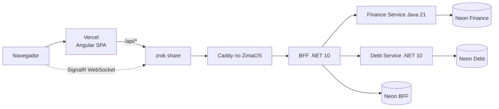

# ADR 0002 — Staging público com Vercel e ZimaOS

- Status: aceito
- Data: 25 de agosto de 2026
- Substitui: [ADR 0001](0001-staging-platform.md)

## Contexto

O projeto exige custo financeiro recorrente igual a zero. A capacidade Ampere
A1 do OCI Always Free não ficou disponível após tentativas controladas, e usar
um fallback pago violaria essa restrição. O proprietário já mantém um servidor
x86-64 com ZimaOS ligado continuamente e aceitou reservar parte dos recursos
para o portfólio.

## Decisão

- publicar a SPA Angular no plano gratuito da Vercel;
- manter chamadas do navegador em `/api/*`, preservando o BFF como única API;
- encaminhar REST pela Vercel e SignalR diretamente ao endpoint público do BFF;
- expor somente o Caddy do ZimaOS por uma share nomeada e persistente do zrok;
- executar BFF, Finance Service e Debt Service no Docker do ZimaOS;
- manter três projetos PostgreSQL independentes no Neon Free;
- usar Brevo para e-mail transacional e Groq como provider de IA configurável;
- publicar imagens multiarch pelo GHCR após merges protegidos em `develop`;
- atualizar os containers por um timer `systemd` que valida health checks e faz
  rollback quando necessário;
- manter Beszel e Uptime Kuma somente na rede local;
- produzir backups semanais locais com restauração automática em recursos
  descartáveis.

## Topologia

## Consequências positivas

- custo recorrente igual a zero sem cadastrar fallback pago;
- bancos continuam fora do servidor residencial e isolados por serviço;
- não é necessário abrir portas no roteador;
- o frontend permanece disponível na Vercel durante manutenções do ZimaOS;
- deploy, rollback, métricas, disponibilidade e restauração são verificáveis.

## Limitações aceitas

- a API pública depende de energia, internet residencial, ZimaOS e zrok;
- o endpoint gratuito do zrok não oferece o mesmo SLA de um domínio e proxy
  comerciais;
- Beszel e Uptime Kuma não são públicos e exigem acesso à LAN;
- os backups atuais permanecem no mesmo host e protegem contra exclusão
  acidental, não contra perda física do disco;
- avisos externos do Uptime Kuma foram adiados e exigem consulta manual ao
  painel.

Essas limitações são aceitáveis para um staging de portfólio. Uma evolução com
usuários pagantes exigirá domínio próprio, cópia criptografada fora do host,
alertas externos e infraestrutura com SLA.
