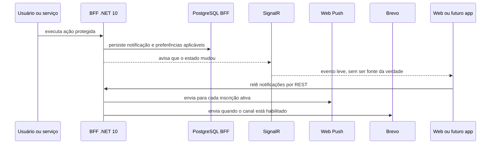
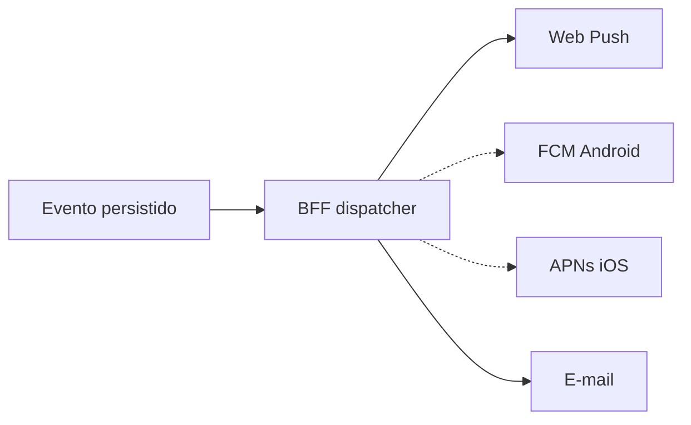

# Arquitetura de notificações

## Objetivo

O Finance Control entrega o mesmo evento por até três canais, sem permitir que
o frontend ou os futuros aplicativos móveis acessem provedores diretamente:

- **Sistema:** registro persistente exibido na central de notificações;
- **Push:** aviso do sistema operacional por Web Push;
- **E-mail:** mensagem transacional enviada pelo BFF.

O BFF é o proprietário do contrato, das preferências e da entrega. Finance e
Debt apenas executam regras de domínio; os endpoints do BFF traduzem as mudanças
relevantes em eventos destinados aos usuários afetados.

## Fluxo ponta a ponta

SignalR não carrega o estado oficial. Ele apenas reduz a necessidade de
recarregar a tela; depois do aviso, o cliente consulta novamente a API REST.
Essa escolha evita divergências depois de reconexões e simplifica os futuros
clientes móveis.

## Catálogo de eventos

As preferências são individuais por usuário e por evento.

| Categoria | Eventos |
|---|---|
| Social | convite de amizade; convite aceito; convite recusado; amizade removida; grupo criado; grupo atualizado; pessoa adicionada; pessoa removida; grupo excluído |
| Dívidas | dívida criada; dívida atualizada; dívida excluída; pagamento registrado; pagamento confirmado; pagamento recusado; pagamento excluído; acerto registrado; acerto confirmado; acerto recusado |
| Finanças | orçamento próximo do limite; orçamento ultrapassado; meta próxima do prazo; meta atrasada; meta concluída |

O catálogo possui 24 eventos. Os identificadores públicos são estáveis em
`UPPER_SNAKE_CASE`, enquanto os textos podem evoluir sem quebrar o contrato.

## Preferências

Existem duas camadas de controle:

1. chaves mestras de e-mail e push no perfil do usuário;
2. seleção `Sistema`, `Push` e `E-mail` para cada evento.

Uma entrega externa só ocorre quando a chave mestra e a preferência do evento
estão habilitadas. O canal Sistema continua persistido conforme sua própria
preferência. O padrão atual habilita Sistema e Push e deixa E-mail desabilitado
por evento, evitando excesso de mensagens.

## Web Push

### Ativação do dispositivo

1. o cliente autenticado consulta a configuração pública do BFF;
2. o BFF retorna somente a chave VAPID pública;
3. o navegador solicita permissão ao usuário;
4. o service worker cria uma inscrição no push service do navegador;
5. endpoint, chave `p256dh`, segredo `auth` e nome do dispositivo são enviados
   somente ao BFF;
6. o BFF associa a inscrição ao usuário autenticado.

A chave VAPID privada permanece exclusivamente no BFF. Trocar o par VAPID
invalida as inscrições existentes e deve ser uma ação deliberada de rotação.

### Entrega

O BFF produz um payload compatível com o service worker do Angular, incluindo:

- título, mensagem, ícone e identificador único;
- tipo do evento e identificador da notificação;
- rota interna que deve ser aberta ao clicar;
- ação `navigateLastFocusedOrOpen` para reutilizar uma aba ou abrir o site.

Respostas `404` ou `410` do push service removem automaticamente inscrições
expiradas. Outras falhas são registradas sem interromper a ação de negócio nem
expor endpoints, chaves ou dados financeiros nos logs.

## E-mail

O dispatcher usa o remetente de aplicação configurado no BFF. Em staging, a
entrega externa usa Brevo; localmente, o Mailpit recebe as mensagens. Título e
corpo são codificados antes de compor o HTML. Uma falha de e-mail não desfaz a
operação financeira ou social que originou a notificação.

## Endpoints do BFF

Todos os endpoints abaixo são protegidos por JWT e versionados em `/api/v1`:

| Operação | Endpoint |
|---|---|
| Listar e filtrar | `GET /api/v1/notifications` |
| Contar não lidas | `GET /api/v1/notifications/unread-count` |
| Marcar uma como lida | `POST /api/v1/notifications/{id}/read` |
| Marcar todas como lidas | `POST /api/v1/notifications/read-all` |
| Sincronizar alertas calculados | `POST /api/v1/notifications/sync` |
| Ler preferências | `GET /api/v1/notifications/preferences` |
| Atualizar preferências | `PUT /api/v1/notifications/preferences` |
| Ler configuração Push | `GET /api/v1/notifications/push/configuration` |
| Listar dispositivos | `GET /api/v1/notifications/push/subscriptions` |
| Registrar dispositivo | `POST /api/v1/notifications/push/subscriptions` |
| Remover dispositivo | `DELETE /api/v1/notifications/push/subscriptions/{id}` |

## Segurança e privacidade

- apenas o usuário autenticado gerencia suas preferências e inscrições;
- endpoints dos push services não são devolvidos na listagem de dispositivos;
- a chave privada VAPID nunca entra no Angular, no Git ou nos logs;
- payloads não carregam saldos, tokens, chaves ou dados financeiros detalhados;
- inscrições são persistidas no PostgreSQL exclusivo do BFF;
- o frontend continua consumindo somente o BFF;
- as variáveis `WEB_PUSH_*` ficam em arquivos locais ignorados pelo Git.

## Aplicativos iOS e Android

O catálogo e as preferências já são independentes do canal web. A evolução
mobile deve manter o BFF como fachada e acrescentar adaptadores de entrega:

Tokens APNs/FCM devem ser tratados como inscrições de dispositivo e nunca como
identidade do usuário. O aplicativo continua lendo o estado oficial por REST;
push é apenas um aviso de mudança.

## Validação da v1.1.0

A release foi validada em produção com um navegador Edge no Windows:

1. permissão concedida no navegador real;
2. dispositivo persistido e exibido na tela de conta;
3. evento social criado por uma segunda conta;
4. notificação exibida na central interna;
5. push service do Windows aceitou a entrega com HTTP `201`;
6. aviso recebido pelo usuário no sistema operacional.

Consulte o [runbook operacional](../operations/runbook.md) e o
[guia do ZimaOS](../operations/zimaos-guide.md) para diagnóstico.
