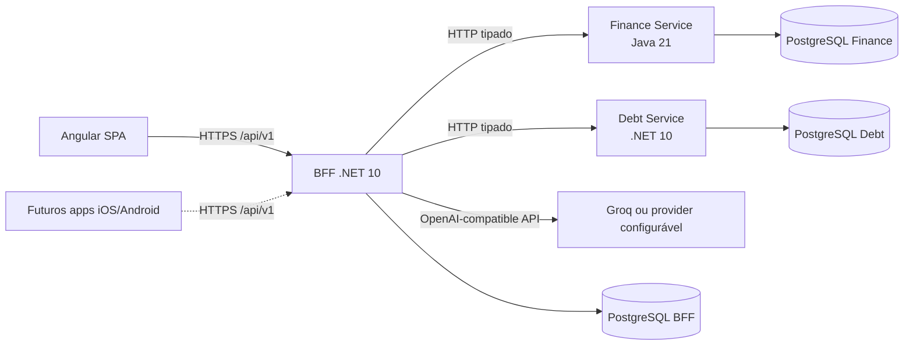
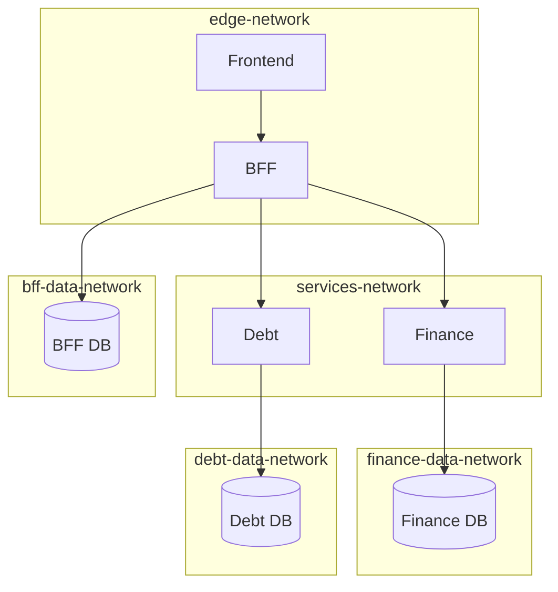

# Visão de arquitetura

## Contexto

O Finance Control separa interface, identidade/agregação e domínios de negócio.
O Angular nunca acessa microserviços ou bancos diretamente. O BFF é a única API
exposta à aplicação e o único componente que emite e valida JWT.

## Responsabilidades

### Frontend

- login, cadastro e ciclo de conta;
- dashboard, finanças, dívidas, pessoas, amizades e grupos;
- central de notificações com atualização via SignalR;
- dark mode, layout responsivo e persistência segura da sessão por cookies;
- nenhuma chamada direta aos microserviços ou ao provedor de IA.

### BFF

- ASP.NET Core Identity, JWT de curta duração e refresh token rotativo em cookie
  HttpOnly;
- autorização, rate limiting e respostas ProblemDetails;
- fachadas tipadas para Finance e Debt;
- agregação paralela do dashboard;
- persistência de perfil, sessões e notificações;
- sanitização, aliases e rate limiting antes de acessar a IA;
- propagação de `X-Correlation-ID` e hub SignalR autenticado.

### Finance Service

- receitas e despesas;
- categorias padrão e personalizadas;
- recorrências, orçamento mensal e resumo por período;
- metas, ledger de aportes e vínculo auditável com receitas;
- tendências e projeção de fluxo de caixa;
- schema controlado por Flyway.

### Debt Service

- pessoas locais e usuários vinculados;
- amizade por convite e grupos autorizados;
- dívidas compartilhadas com pagador e participantes independentes;
- pagamentos com confirmação/rejeição;
- histórico da dívida;
- cálculo de transferências simplificadas;
- schema controlado por Entity Framework Core Migrations.

## Redes e persistência

Nenhum serviço participa da rede de dados de outro domínio. Finance e Debt não
publicam portas no host no Compose integrado.

## Fluxos principais

### Dashboard

O BFF consulta em paralelo resumo, tendências, orçamento, metas e projeção no
Finance Service e a posição consolidada no Debt Service. O Angular recebe um
contrato próprio do BFF.

### Notificações

Eventos de amizades, grupos, dívidas, pagamentos, liquidações, orçamentos e
metas são persistidos no BFF. O SignalR apenas avisa que houve mudança; o cliente
sempre relê o estado oficial pelos endpoints REST. Chaves de deduplicação evitam
alertas repetidos após reconexões.

### Inteligência artificial

O BFF calcula respostas factuais determinísticas quando possível. Para perguntas
abertas, remove identificadores e substitui nomes, grupos e descrições por
aliases antes de chamar um provider compatível com OpenAI. O mapa de aliases
nunca sai do BFF e os números exibidos continuam vindo dos serviços de domínio.

## Observabilidade

Cada requisição recebe um UUID em `X-Correlation-ID`. O BFF propaga esse valor
aos microserviços. Logs estruturados registram método, caminho, status e duração,
sem payloads, tokens ou parâmetros financeiros. ProblemDetails inclui
`correlationId` e `traceId`.
