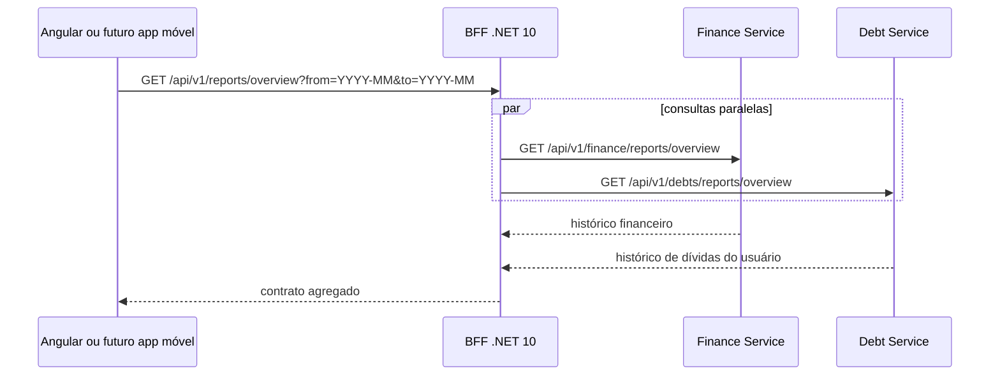

# Relatórios e histórico analítico

## Objetivo

O módulo oferece uma visão histórica única de finanças pessoais e dívidas sem
violar os limites entre os domínios. O Angular consulta apenas o BFF; Finance e
Debt calculam suas próprias métricas usando exclusivamente seus bancos.

## Contratos

Todos os endpoints abaixo são protegidos e versionados em `/api/v1`.

| Componente | Endpoint | Responsabilidade |
|---|---|---|
| BFF | `GET /api/v1/reports/overview` | agrega Finance e Debt e calcula destaques |
| BFF | `GET /api/v1/reports/export.csv` | exporta o mesmo período em CSV UTF-8 |
| Finance | `GET /api/v1/finance/reports/overview` | receitas, despesas, saldo, categorias e maiores saídas |
| Debt | `GET /api/v1/debts/reports/overview` | volume, posição do usuário, categorias e maiores dívidas |

Os parâmetros `from` e `to` do BFF usam `YYYY-MM`. O período padrão contém os
seis meses mais recentes e cada consulta aceita no máximo 24 meses. O limite
reduz consultas acidentais muito amplas e mantém o contrato adequado para web e
para os futuros aplicativos móveis.

## Métricas entregues

Finance retorna:

- total de receitas, despesas, saldo e taxa de economia;
- quantidade de lançamentos e série mensal cronológica;
- despesas agrupadas por categoria padrão ou personalizada;
- cinco maiores despesas do período.

Debt retorna:

- volume total das dívidas visíveis ao usuário;
- valores que o usuário deve e tem a receber;
- dívidas abertas e quitadas, série mensal e agrupamento por categoria;
- cinco maiores posições do período.

O BFF acrescenta média mensal de receitas e despesas, mês com melhor saldo e
maior categoria de gasto. As consultas aos serviços são paralelas e o CSV é
montado no BFF, portanto nenhum cliente precisa conhecer contratos internos.

## Interface e exportação

A rota Angular `/reports` possui filtro mensal, cartões consolidados, gráfico de
receitas e despesas, categorias, maiores lançamentos e botão de exportação. O
CSV usa ponto e vírgula e BOM UTF-8 para abrir corretamente em planilhas com
textos em português.

O relatório é uma projeção somente leitura dos dados já existentes. Não existe
novo banco, tabela compartilhada ou migration para essa funcionalidade.
