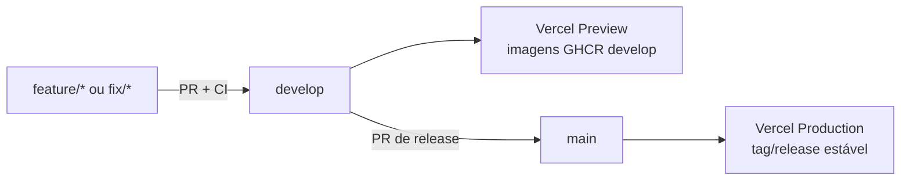

# Git Flow e implantação

## Objetivo

Toda alteração passa por revisão e CI antes de atingir `develop` ou `main`.
Branches devem indicar sua intenção e nunca usar nomes de ferramentas ou
agentes.

## Branches permitidas

| Prefixo | Uso | Destino normal |
|---|---|---|
| `feature/` | nova capacidade | `develop` |
| `fix/` | correção comum | `develop` |
| `release/` | preparação coordenada de versão | `main` |
| `hotfix/` | correção urgente da produção | `main` e depois `develop` |
| `docs/` | documentação isolada | `develop` |
| `chore/` | manutenção técnica sem feature | `develop` |

Exemplos: `feature/notification-preferences`, `fix/social-card-spacing` e
`release/v1.1.0`. Branches `codex/*` não fazem parte do padrão do projeto.

## Fluxo de uma mudança



1. atualize `develop` e crie uma branch com prefixo correto;
2. implemente e teste apenas o repositório necessário;
3. atualize contrato OpenAPI e documentação quando o contrato mudar;
4. abra PR para `develop` e aguarde todos os checks protegidos;
5. valide o ambiente de preview/staging;
6. abra uma release coordenada de `develop` para `main`;
7. valide a produção e publique a tag semântica.

## O que acontece após o merge

### Backends

O CI de BFF, Finance e Debt executa build, testes e validação OpenAPI. No merge
em `develop`, publica no GHCR:

- uma imagem mutável `develop`, usada pelo ambiente de portfólio no ZimaOS;
- uma imagem imutável `sha-<commit>`, usada para rastreabilidade e rollback.

O timer de atualização do ZimaOS verifica imagens a cada cinco minutos. Quando
detecta uma combinação nova, preserva a anterior, atualiza a stack e aguarda os
health checks. Uma falha provoca rollback e coloca a combinação defeituosa em
quarentena.

### Frontend

- PRs e `develop` geram **Preview Deployments** na Vercel;
- `main` gera o **Production Deployment**;
- o frontend usa caminhos relativos `/api/*`, reescritos para a entrada zrok;
- nenhuma variável de frontend contém segredo ou endereço de microserviço.

## Release estável

Uma release só deve promover `develop` para `main` quando:

- CIs dos repositórios alterados estiverem verdes;
- E2E integrado estiver aprovado;
- contratos OpenAPI forem compatíveis;
- migrations tiverem caminho seguro;
- smoke test do ambiente público tiver passado;
- changelog e documento da release estiverem atualizados.

O merge em `main` não muda automaticamente a arquitetura do ZimaOS, que
atualmente acompanha as imagens `develop` para funcionar como staging público
de portfólio. Uma eventual separação entre staging e produção exige nova
decisão arquitetural.

## Rollback

### Backend no ZimaOS

1. confirme a falha em `AutoDeployLogs` e `Health`;
2. deixe o rollback automático restaurar o conjunto anterior;
3. identifique a tag imutável `sha-<commit>` nos registros, sem substituir tags
   manualmente;
4. corrija em `fix/*` e publique outra imagem pelo fluxo normal;
5. não remova a quarentena sem entender a causa.

### Frontend na Vercel

Use o histórico de deployments para identificar a versão saudável. Faça a
correção no Git e promova pelo fluxo protegido; uma promoção emergencial deve
ser registrada como `hotfix/*` e reconciliada com `develop`.

## Segredos e configuração

- segredos do GitHub ficam em Actions Secrets;
- variáveis da Vercel ficam no projeto e no ambiente correto;
- segredos do ZimaOS ficam em `/DATA/AppData/finance-control/.env*`;
- credenciais do administrador ficam em `%USERPROFILE%/.finance-control/`;
- arquivos reais nunca são commitados; somente exemplos sem valores sensíveis;
- troca de segredo deve ser seguida por sincronização, restart e health check.

## Verificação manual

```powershell
Set-Location ..\finance-control-infra
pwsh -File .\tools\Invoke-ZimaOsFinanceControl.ps1 -Action RunAutoDeploy
pwsh -File .\tools\Invoke-ZimaOsFinanceControl.ps1 -Action AutoDeployStatus
pwsh -File .\tools\Invoke-ZimaOsFinanceControl.ps1 -Action Health
pwsh -File .\tools\Test-PublicStaging.ps1
```

Consulte o [guia do ZimaOS](../operations/zimaos-guide.md) para operar o host e
o [runbook](../operations/runbook.md) para diagnosticar falhas.
