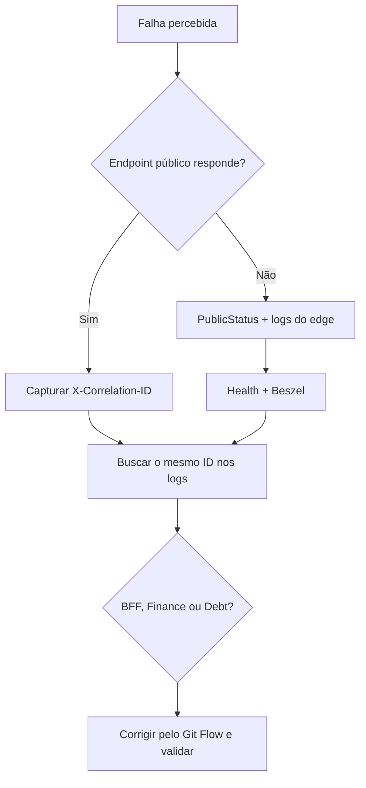

# Observabilidade

## Objetivo

A observabilidade responde a três perguntas diferentes:

1. **o host e os containers têm recursos?** Beszel;
2. **a aplicação está acessível?** Uptime Kuma;
3. **por que uma requisição falhou?** logs estruturados e correlation ID.

Beszel e Uptime Kuma ficam somente na rede local. A Vercel é acompanhada pelo
monitor público do Kuma e pelo painel próprio da plataforma, sem instalar um
agente Beszel nela.

## Componentes

| Componente | Versão | O que mostra | Acesso |
|---|---:|---|---|
| Beszel Hub | `0.18.8` | histórico e painel do host | LAN, atalho ZimaOS |
| Beszel Agent | `0.18.8` | CPU, RAM, disco, containers e `systemd` | interno |
| Uptime Kuma | `2.3.2` | disponibilidade e heartbeat | LAN, atalho ZimaOS |
| Docker socket proxy | versão fixada no Compose | metadados mínimos de containers | rede interna |
| Logs das aplicações | imagens versionadas | erros, duração, status e correlação | helper SSH |

## O que monitorar

### Beszel

- CPU e memória do ZimaOS;
- ocupação e crescimento do disco;
- reinícios e consumo por container;
- disponibilidade do agente;
- timers de deploy e backup no `systemd`.

### Uptime Kuma

- frontend público na Vercel;
- `/health` público do BFF pela entrada zrok/Caddy;
- heartbeat enviado pela camada de observabilidade;
- tempo de resposta e histórico de indisponibilidade.

Finance e Debt não recebem monitores públicos: o health agregado do BFF e os
containers internos preservam a regra de que somente o BFF é exposto.

## Fluxo de diagnóstico



Comandos principais:

```powershell
pwsh -File .\tools\Invoke-ZimaOsFinanceControl.ps1 -Action ObservabilityStatus
pwsh -File .\tools\Invoke-ZimaOsFinanceControl.ps1 -Action ObservabilityHealth
pwsh -File .\tools\Invoke-ZimaOsFinanceControl.ps1 -Action ObservabilityLogs -Tail 200
pwsh -File .\tools\Invoke-ZimaOsFinanceControl.ps1 -Action Health
pwsh -File .\tools\Invoke-ZimaOsFinanceControl.ps1 -Action PublicStatus
```

## Correlation ID

O BFF aceita ou cria um UUID em `X-Correlation-ID` e o propaga aos serviços.
ProblemDetails inclui `correlationId` e `traceId`. Para investigar:

1. copie o `X-Correlation-ID` da resposta com erro;
2. consulte os logs do BFF;
3. se houver chamada interna, busque o mesmo UUID em Finance ou Debt;
4. compare horário, caminho, status e duração;
5. não procure por payloads: eles não são gravados por segurança.

## Limites e segurança

- os logs não devem registrar JWT, cookies, senhas ou valores financeiros;
- o socket Docker é acessado por proxy com permissões mínimas;
- painéis administrativos não são publicados no túnel;
- o Kuma verifica interfaces públicas, não acessa bancos diretamente;
- alertas externos estão adiados; por enquanto a consulta é manual;
- Beszel não substitui logs de aplicação, e Kuma não substitui métricas do host.

## Rotina operacional

Após um deploy, confirme:

1. deployment aprovado na Vercel ou imagem nova no GHCR;
2. containers saudáveis no Beszel;
3. frontend e BFF verdes no Kuma;
4. login e uma operação real no smoke test;
5. ausência de erro novo nos logs.

Em uma entrevista, a síntese é: **Kuma mede disponibilidade, Beszel mede saúde
do servidor e correlation ID conecta o erro observado aos logs distribuídos**.

Consulte também o [runbook](runbook.md) e o
[guia do ZimaOS](zimaos-guide.md).
