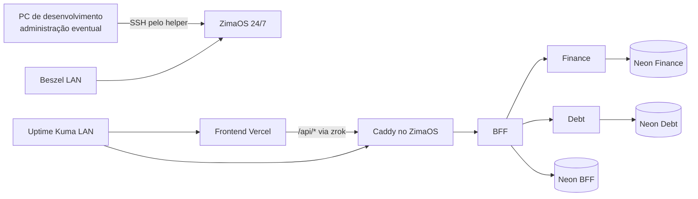

# Guia do servidor ZimaOS

## Papel do servidor

O ZimaOS é o host que mantém os backends do Finance Control disponíveis 24 horas
por dia. O computador de desenvolvimento não precisa permanecer ligado. Ele é
usado apenas para desenvolver, aprovar mudanças e executar o helper de
administração remota.

No ZimaOS rodam:

- Caddy, como único proxy de entrada da API;
- zrok, como túnel HTTPS público sem abertura de portas no roteador;
- BFF, Finance Service e Debt Service em containers separados;
- Beszel e Uptime Kuma, acessíveis somente na rede local;
- timers de deploy automático e backup;
- arquivos operacionais e backups locais.

Os bancos não rodam no ZimaOS: cada serviço usa seu próprio PostgreSQL Neon.
O frontend também não roda no servidor: a SPA é publicada pela Vercel.

## Modelo mental



## Onde ver tudo rodando

### Home do ZimaOS

A Home mostra os atalhos instalados e o estado geral do host. Os dois painéis
mais importantes são:

- **Beszel:** CPU, memória, disco, temperatura quando disponível, containers e
  unidades `systemd`;
- **Uptime Kuma:** disponibilidade do frontend, health público do BFF e
  heartbeat do Beszel.

Os painéis permanecem somente na LAN. Não publique as portas `8090` ou `3001`
no zrok.

### Terminal administrativo

No PowerShell, dentro de `finance-control-infra`:

```powershell
pwsh -File .\tools\Invoke-ZimaOsFinanceControl.ps1 -Action Status
pwsh -File .\tools\Invoke-ZimaOsFinanceControl.ps1 -Action Health
pwsh -File .\tools\Invoke-ZimaOsFinanceControl.ps1 -Action PublicStatus
pwsh -File .\tools\Invoke-ZimaOsFinanceControl.ps1 -Action ObservabilityStatus
pwsh -File .\tools\Invoke-ZimaOsFinanceControl.ps1 -Action AutoDeployStatus
pwsh -File .\tools\Invoke-ZimaOsFinanceControl.ps1 -Action BackupStatus
```

Esses comandos usam a chave SSH local e a credencial sudo protegida por DPAPI.
Não exigem que senhas sejam coladas no terminal ou salvas no Git.

## Inventário de arquivos

| Local | Função |
|---|---|
| `compose.zimaos.yml` | aplicação, redes, edge, zrok e limites de recursos |
| `compose.observability.yml` | Beszel, agente, socket proxy e Uptime Kuma |
| `deploy/zimaos/` | Caddy, timers, backup, deploy e atalhos |
| `tools/Invoke-ZimaOsFinanceControl.ps1` | interface administrativa permitida |
| `%USERPROFILE%/.finance-control/` | chave SSH, known hosts e DPAPI do computador administrador |
| `/DATA/AppData/finance-control/` | configuração efetiva instalada no servidor |
| `/DATA/AppData/finance-control/backups/` | backups completos retidos no ZimaOS |

Arquivos `.env*`, tokens, chaves e connection strings são ignorados pelo Git.

## Operações usuais

### Consultar logs

```powershell
pwsh -File .\tools\Invoke-ZimaOsFinanceControl.ps1 -Action Logs -Service bff -Tail 200
pwsh -File .\tools\Invoke-ZimaOsFinanceControl.ps1 -Action Logs -Service finance-service -Tail 200
pwsh -File .\tools\Invoke-ZimaOsFinanceControl.ps1 -Action Logs -Service debt-service -Tail 200
pwsh -File .\tools\Invoke-ZimaOsFinanceControl.ps1 -Action Logs -Service edge -Tail 200
pwsh -File .\tools\Invoke-ZimaOsFinanceControl.ps1 -Action AutoDeployLogs -Tail 200
pwsh -File .\tools\Invoke-ZimaOsFinanceControl.ps1 -Action BackupLogs -Tail 200
```

### Atualizar configuração versionada

```powershell
pwsh -File .\tools\Invoke-ZimaOsFinanceControl.ps1 -Action SyncDeployment
pwsh -File .\tools\Invoke-ZimaOsFinanceControl.ps1 -Action Health
```

### Atualizar variáveis locais do servidor

```powershell
pwsh -File .\tools\Invoke-ZimaOsFinanceControl.ps1 -Action SyncEnvironmentOnly
pwsh -File .\tools\Invoke-ZimaOsFinanceControl.ps1 -Action Restart
pwsh -File .\tools\Invoke-ZimaOsFinanceControl.ps1 -Action Health
```

Use `SyncEnvironment` somente quando for necessário sincronizar e aplicar as
variáveis de ambiente numa mesma operação.

### Executar deploy ou backup manual

```powershell
pwsh -File .\tools\Invoke-ZimaOsFinanceControl.ps1 -Action RunAutoDeploy
pwsh -File .\tools\Invoke-ZimaOsFinanceControl.ps1 -Action RunBackup
pwsh -File .\tools\Invoke-ZimaOsFinanceControl.ps1 -Action VerifyLatestBackup
```

## Depois de reiniciar o ZimaOS

Os containers usam `restart: unless-stopped`, a identidade zrok é persistida e
os timers usam `Persistent=true`. Mesmo assim, valide nesta ordem:

1. `Status` e `Health`;
2. `PublicStatus`;
3. `ObservabilityHealth`;
4. `AutoDeployStatus`;
5. `BackupStatus`;
6. frontend e login pelo endereço público.

## Regras de segurança

- nunca execute `docker compose down --volumes` no ambiente público;
- nunca exponha Finance, Debt, Neon, Beszel, Kuma ou a interface do ZimaOS;
- nunca edite a stack somente pela interface gráfica e deixe o Compose
  versionado divergente;
- nunca misture as três connection strings;
- faça backup e verifique a restauração antes de mudanças de alto risco;
- prefira o helper versionado a comandos SSH manuais;
- não compartilhe logs sem revisar tokens, URLs e dados operacionais.

## Rotina de manutenção recomendada

| Frequência | Verificação |
|---|---|
| Após cada deploy | health, frontend, login e logs sem erros novos |
| Semanal | backup, restauração de teste, disco e Uptime Kuma |
| Mensal | atualizações de imagens, dependências, retenção e acessos |
| Após queda de energia | checklist completo de reinicialização |

Para incidentes detalhados, consulte o [runbook](runbook.md), a
[observabilidade](observability.md) e o guia de
[backup e restauração](backup-restore.md).
